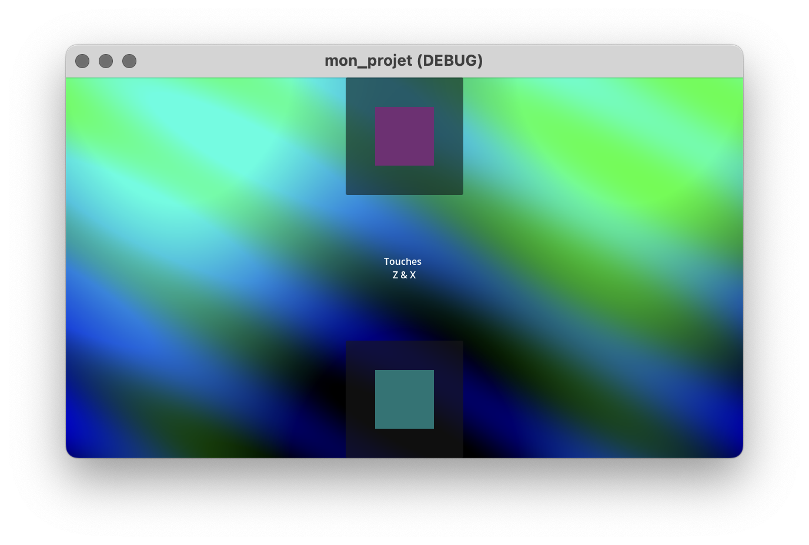
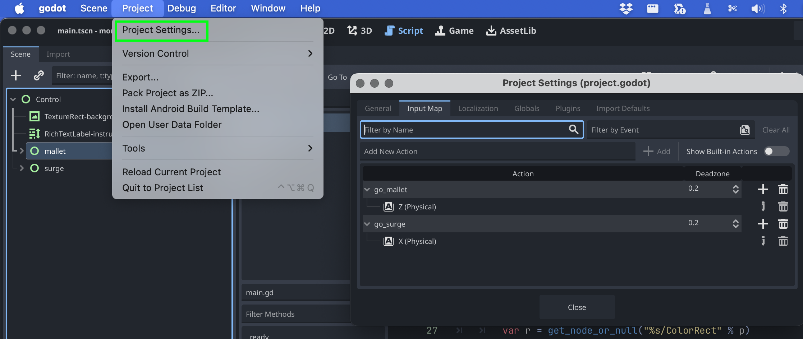

# gd-webexport-minimal (projet pédagogique)



Petit projet Godot minimal pensé pour l'export Web (HTML/WASM) et pour
apprendre les bases : écoute d'actions, lecture audio, interpolation de
couleurs et configuration d'export.

- Montrer comment lier des actions d'entrée à du code GDScript.
- Jouer des sons via `AudioStreamPlayer` depuis un script.
- Faire des transitions visuelles (fondu de couleurs) en temps réel.
- Préparer un dossier d'export (`/docs`) pour la mise en ligne web.
- Godot Engine 4.4 (le fichier `project.godot` référence "4.4").

## Structure du dépôt
- `mon_projet/` : scène Godot et scripts (principal : `main.gd`).
- `docs/` : dossier d'export (index.html + fichiers wasm/js) — prêt pour hébergement statique.
- `audio/`, `img/` : assets utilisés par le projet.


## Entrées / contrôles
- Deux actions sont utilisées (Project Settings > Input Map) :
	- `go_mallet` — déclenche l'instrument "mallet" (touche configurée dans `project.godot`).
	- `go_surge`  — déclenche l'instrument "surge".

### Ce que fait `main.gd`
- Écoute les actions `go_mallet` et `go_surge` par frame.
- Joue le `AudioStreamPlayer` situé sous `mallet/AudioStreamPlayer` ou `surge/AudioStreamPlayer`.
- Définit une nouvelle couleur cible aléatoire pour le `ColorRect` lié et lisse la transition avec `lerp`.
- Met à jour la teinte du fond (`TextureRect-background.modulate`) ; "mallet" incrémente la teinte, "surge" la décrémente.

### Schéma interactif

```mermaid
stateDiagram-v2
    [*] --> Idle

    Idle --> MalletPress : go_mallet / bouton
    Idle --> SurgePress  : go_surge  / bouton

    MalletPress --> Play : player exists ? / player.play()
    SurgePress  --> Play : player exists ? / player.play()
    MalletPress --> MissingNode : else / ignore
    SurgePress  --> MissingNode : else / ignore

    Play --> SetColorTarget : définir _targets[prefix]
    Play --> UpdateBg        : hue_progress +/- hue_step & _targets["bg"]

    SetColorTarget --> ColorFading : lerp vers cible (color_lerp_speed)
    UpdateBg       --> BgFading    : lerp vers cible (bg_lerp_speed)

    ColorFading --> Idle
    BgFading    --> Idle
    MissingNode  --> Idle

    Play --> Play : polyphony (self-loop)
 ```   

### Personnalisation rapide
- Modifier la vitesse de fondu des ColorRect : ouvrez `mon_projet/main.gd` et changez `color_lerp_speed` (valeur par défaut 16.0). Valeur plus élevée → fondu plus rapide.
- Modifier la vitesse de fondu du fond : changez `bg_lerp_speed` (valeur par défaut 10.0).
- Modifier le pas de teinte : chercher `hue_progress = wrapf(... +/- 0.01 ...)` dans `main.gd` et ajuster `0.01`.

### Conseils de debug
- Si rien ne se passe à la pression d'une touche, vérifier que l'action est définie dans Project Settings > Input Map (les touches sont visibles dans `project.godot`).
- Si un son ne joue pas, vérifier que le nœud `AudioStreamPlayer` existe sous `mallet` ou `surge` et que son `Stream` est défini.
- Pour éviter les erreurs à l'exécution, les accès aux nœuds sont faits via `get_node_or_null` ; si un nœud manque, l'opération est ignorée.

## Exporter pour le web
- Utiliser le dossier `docs/` comme destination d'export (déjà présent dans le repo).
- Placer `.nojekyll` dans `docs/` si vous publiez sur GitHub Pages pour servir le HTML statique sans filtrage.


### Diagramme des nœuds (scène `main.tscn`)
Le fichier `mon_projet/main.tscn` contient la scène principale suivant cette
structure (diagramme ASCII) :

```
Control (script : `main.gd`)
├─ TextureRect-background (texture : `img/fond.png`)  ← modulate utilisé pour la teinte du fond
├─ RichTextLabel-instructions                         ← texte d'aide (Z & X)
├─ mallet (Control)
│  ├─ AudioStreamPlayer (stream : `audio/...-mallet.ogg`)
│  ├─ ColorRect                                      ← fond du bouton mallet (interpolé)
│  └─ Button-mallet                                  ← signal : _on_buttonmallet_pressed
└─ surge (Control)
	 ├─ AudioStreamPlayer (stream : `audio/...-surge.ogg`)
	 ├─ ColorRect                                      ← fond du bouton surge (interpolé)
	 └─ Button-surge                                   ← signal : _on_buttonsurge_pressed
```

Chemins attendus par le script `main.gd` :
- `mallet/AudioStreamPlayer`, `mallet/ColorRect`, `mallet/Button-mallet`
- `surge/AudioStreamPlayer`, `surge/ColorRect`, `surge/Button-surge`
- `TextureRect-background`

Si vous renommez un nœud, adaptez soit le nom, soit les chemins dans `main.gd`.

### Organisation des assets
- `mon_projet/audio/` : fichiers audio (OGG/WAV). Nommer les fichiers avec un
	préfixe clair (ex. `mallet-*.ogg`, `surge-*.ogg`) facilite le repérage.
- `mon_projet/img/` : textures et images (fond, icônes). Préférez des textures
	redimensionnées à la résolution cible pour le web (ex. 1024×1024 ou 2048×2048
	selon besoin).
- Import : pour l'export web, préférez OGG pour les petits samples ; conservez
	des WAV non compressés pour l'édition si nécessaire.

Conseils d'import :
- Audio : régler `max_polyphony` si vous voulez permettre des notes superposées.
- Images : activer/désactiver `Filter` selon look voulu ; pour pixel-art désactiver.

### Input Mapping
- Les actions d'entrée sont définies dans `project.godot` :
	- `go_mallet` (touche configurée, par défaut Z)
	- `go_surge`  (touche configurée, par défaut X)

Vous pouvez changer ces touches via Project Settings > Input Map.



### Paramètres modifiables dans `main.gd`
- `color_lerp_speed` : vitesse du fondu des ColorRect (plus élevé = plus rapide).
- `bg_lerp_speed` : vitesse du fondu du fond (modulate).
- `hue_progress` (step dans le code) : valeur ajoutée/subtractée par trigger
	(par défaut ±0.01). Chercher `hue_progress = wrapf(...)` pour modifier.

### Déploiement Web (rappel)
- Le dossier `docs/` contient les fichiers d'export (index.html, wasm, js).
- Pour GitHub Pages, ajouter un fichier `.nojekyll` dans `docs/` pour servir
	correctement les fichiers WASM/JS.

